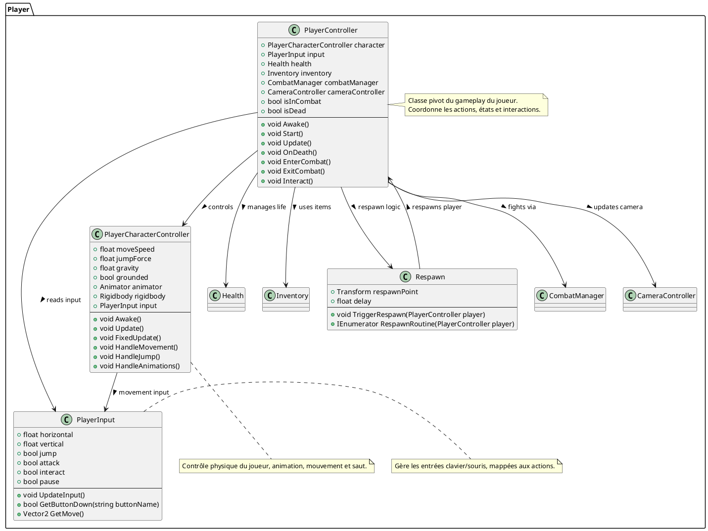

# classes_player.puml


# classes_camera.puml
````plantuml
@startuml
' ========================================================
' 3D Gamekit - Diagramme de classes : Camera
' Contient les classes gérant la caméra et le suivi du joueur
' ========================================================

package CameraSystem {

class CameraController {
    +Transform target
    +float rotationSpeed
    +float distance
    +float height
    +float smoothTime
    +Vector3 offset
    +bool lockOnTarget
    --
    +void Awake()
    +void Start()
    +void LateUpdate()
    +void HandleRotation()
    +void HandleZoom()
    +void HandleCollision()
}

class FollowTarget {
    +Transform target
    +float followSpeed
    +Vector3 offset
    --
    +void LateUpdate()
}

class CameraShake {
    +float shakeDuration
    +float shakeMagnitude
    +float dampingSpeed
    +bool isShaking
    --
    +void TriggerShake(float duration, float magnitude)
    +IEnumerator ShakeCoroutine()
    +void StopShake()
}

class LockOnSystem {
    +Transform currentTarget
    +float lockRange
    +LayerMask targetMask
    --
    +void FindTarget()
    +void LockOn()
    +void Unlock()
}

' Relations
CameraController --> FollowTarget : uses >
CameraController --> CameraShake : triggers >
CameraController --> LockOnSystem : optional lock >
FollowTarget --> Transform : follows >
LockOnSystem --> Transform : target reference >

note right of CameraController
Composant principal de la caméra.
Suit et pivote autour du joueur avec interpolation fluide.
end note

note bottom of CameraShake
Effet visuel de secousse lors des impacts ou explosions.
end note

note right of LockOnSystem
Permet de cibler un ennemi pour le combat rapproché.
end note

}

@enduml
````

# classes_combat.puml

````plantuml
@startuml
' ========================================================
' 3D Gamekit - Diagramme de classes : Combat et Dégâts
' Gère les mécaniques de vie, combat et collisions
' ========================================================

package CombatSystem {

class Health {
    +float maxHealth
    +float currentHealth
    +bool invulnerable
    +UnityEvent onDeath
    +UnityEvent onDamage
    --
    +void Awake()
    +void TakeDamage(float amount)
    +void Heal(float amount)
    +void Die()
    +bool IsDead()
}

class Damageable {
    +Health health
    +bool canBeDamaged
    --
    +void OnHit(float damage)
    +void OnCollisionEnter(Collision collision)
}

class ContactDamager {
    +float damage
    +bool active
    +string damageSource
    +LayerMask targetLayer
    --
    +void ActivateDamager(bool state)
    +void OnTriggerEnter(Collider other)
    +void DealDamage(Damageable target)
}

class Projectile {
    +float speed
    +float lifetime
    +float damage
    +Rigidbody rigidbody
    +Vector3 direction
    --
    +void Start()
    +void Update()
    +void OnTriggerEnter(Collider other)
}

class CombatManager {
    +List<Damageable> enemies
    +PlayerController player
    +bool turnBasedMode
    +int currentTurnIndex
    +float turnTimer
    --
    +void Register(Damageable d)
    +void Unregister(Damageable d)
    +void StartCombat()
    +IEnumerator CombatLoop()
    +void EndCombat()
}

' Relations
Damageable --> Health : owns >
ContactDamager --> Damageable : applies damage >
Projectile --> Damageable : hits >
CombatManager --> Damageable : manages enemies >
CombatManager --> PlayerController : coordinates combat >
Health --> UnityEvent : triggers >

note top of Health
Composant de gestion de la santé d'un personnage.
end note

note right of CombatManager
Contrôle les séquences de combat, y compris le tour par tour.
end note

note bottom of ContactDamager
Applique les dégâts lors des collisions physiques ou déclencheurs.
end note

}

@enduml
````
#classes_enemy.puml

````plantuml
@startuml
' ========================================================
' 3D Gamekit - Diagramme de classes : Ennemis et IA
' Gestion du comportement, détection et génération des ennemis
' ========================================================

package EnemyAI {

class EnemyController {
    +float moveSpeed
    +float detectionRange
    +float attackRange
    +float attackCooldown
    +Animator animator
    +Health health
    +TargetScanner scanner
    +EnemyBehaviour currentBehaviour
    +Transform target
    --
    +void Awake()
    +void Update()
    +void Patrol()
    +void Chase()
    +void Attack()
    +void TakeHit(float amount)
    +void Die()
}

class EnemyBehaviour {
    +string stateName
    +EnemyController controller
    --
    +void OnEnter()
    +void OnUpdate()
    +void OnExit()
}

class TargetScanner {
    +float scanRange
    +float fieldOfView
    +LayerMask targetMask
    +Transform detectedTarget
    --
    +bool DetectTarget(Transform origin)
    +Transform GetTarget()
}

class EnemySpawner {
    +GameObject enemyPrefab
    +Transform[] spawnPoints
    +float spawnDelay
    +int maxEnemies
    +List<GameObject> activeEnemies
    --
    +void Start()
    +IEnumerator SpawnRoutine()
    +void SpawnEnemy()
    +void ClearEnemies()
}

class PatrolRoute {
    +Transform[] waypoints
    +int currentIndex
    --
    +Transform GetNextWaypoint()
    +void Reset()
}

' Relations
EnemyController --> Health : has >
EnemyController --> TargetScanner : uses >
EnemyController --> EnemyBehaviour : current >
EnemyController --> PatrolRoute : follows >
EnemySpawner --> EnemyController : instantiates >
EnemySpawner --> GameObject : spawns >
TargetScanner --> Transform : detects >
EnemyBehaviour --> EnemyController : controls >

note right of EnemyController
Contrôle principal de l'IA d’un ennemi :
détection, poursuite, attaque et mort.
end note

note right of TargetScanner
Effectue la détection des cibles dans un rayon donné.
end note

note right of EnemySpawner
Gère la génération périodique et la réinitialisation des ennemis.
end note

}

@enduml

````

# classes_quest.puml

````plantuml
@startuml
' ========================================================
' 3D Gamekit - Diagramme de classes : Quêtes
' Gestion des quêtes, objectifs et suivi de progression
' ========================================================

package QuestSystem {

class QuestManager {
    +List<Quest> activeQuests
    +List<Quest> completedQuests
    +UIManager uiManager
    --
    +void Start()
    +void AddQuest(Quest quest)
    +void CompleteQuest(Quest quest)
    +Quest GetQuestByID(string id)
    +void UpdateUI()
}

class Quest {
    +string questID
    +string title
    +string description
    +bool isCompleted
    +List<Objective> objectives
    --
    +void StartQuest()
    +void CheckProgress()
    +void CompleteQuest()
}

class Objective {
    +string objectiveID
    +string description
    +bool isCompleted
    +int currentAmount
    +int requiredAmount
    --
    +void UpdateProgress(int value)
    +bool IsComplete()
}

class CollectObjective extends Objective {
    +string itemName
    +int requiredCount
    --
    +void OnItemCollected(string itemName)
}

class KillObjective extends Objective {
    +string targetName
    +int requiredKills
    --
    +void OnEnemyKilled(string enemyName)
}

class TalkObjective extends Objective {
    +string npcName
    --
    +void OnDialogueComplete(string npc)
}

class QuestGiver {
    +Quest questToGive
    +bool questGiven
    --
    +void Interact(PlayerController player)
    +void GiveQuest()
}

' Relations
QuestManager --> Quest : manages >
Quest --> Objective : contains >
CollectObjective -|> Objective
KillObjective -|> Objective
TalkObjective -|> Objective
QuestGiver --> Quest : gives >
QuestManager --> UIManager : updates UI >
Objective --> QuestManager : reports progress >

note right of QuestManager
Contrôle global du système de quêtes et leur affichage UI.
end note

note right of Quest
Regroupe des objectifs et gère leur état d’avancement.
end note

note bottom of Objective
Classe de base pour tous les types d’objectifs (collecte, kill, dialogue).
end note

note right of QuestGiver
Interagit avec le joueur pour déclencher ou compléter une quête.
end note

}

@enduml

````
# classes_interactables.puml

````plantuml
@startuml
'===============================================================
'   Diagramme de classes : Éléments interactables du jeu RPG 3D
'===============================================================

package "Interactions" {

    '--------------------------
    ' Classe abstraite de base
    '--------------------------
    abstract class Interactable {
        + id : int
        + name : string
        + position : Vector3
        + isActive : bool
        --
        + Interact(player : Player)
        + Highlight(state : bool)
    }

    '--------------------------
    ' Objets ramassables
    '--------------------------
    class Collectible extends Interactable {
        + itemType : ItemType
        + quantity : int
        --
        + Collect(player : Player)
    }

    '--------------------------
    ' Coffres
    '--------------------------
    class Chest extends Interactable {
        + contents : List<Item>
        + isLocked : bool
        + keyId : int
        --
        + Open(player : Player)
        + Close()
        + Unlock(key : Item)
    }

    '--------------------------
    ' PNJ (Personnages non joueurs)
    '--------------------------
    class NPC extends Interactable {
        + dialogueId : int
        + canTrade : bool
        + canFight : bool
        --
        + Talk(player : Player)
        + Trade(player : Player)
        + Attack(player : Player)
    }

    '--------------------------
    ' Leviers, boutons, interrupteurs
    '--------------------------
    class Switch extends Interactable {
        + isOn : bool
        + linkedObjectId : int
        --
        + Toggle()
    }

    '--------------------------
    ' Portes
    '--------------------------
    class Door extends Interactable {
        + isOpen : bool
        + isLocked : bool
        + keyId : int
        --
        + Open()
        + Close()
        + Unlock(key : Item)
    }
}

'----------------------------------------------------------
' Relations et généralisations
'----------------------------------------------------------
Interactable <|-- Collectible
Interactable <|-- Chest
Interactable <|-- NPC
Interactable <|-- Switch
Interactable <|-- Door

'----------------------------------------------------------
' Types associés
'----------------------------------------------------------
class Player {
    + id : int
    + name : string
    + inventory : Inventory
    --
    + InteractWith(target : Interactable)
}

class Item {
    + id : int
    + name : string
    + type : ItemType
}

enum ItemType {
    WEAPON
    ARMOR
    POTION
    QUEST_ITEM
    KEY
    RESOURCE
}

class Inventory {
    + items : List<Item>
    --
    + Add(item : Item)
    + Remove(item : Item)
    + HasItem(id : int) : bool
}

Player "1" -- "*" Interactable : "peut interagir avec"
Chest "1" o-- "*" Item : "contient"
Inventory "1" o-- "*" Item

@enduml

````

# classes_combat.puml

````plantuml
@startuml
'===============================================================
'   Diagramme de classes : Système de combat du RPG 3D
'===============================================================

package "CombatSystem" {

    '--------------------------
    ' Classe principale
    '--------------------------
    class CombatManager {
        - activeBattles : List<Battle>
        --
        + StartBattle(attacker : Character, defender : Character)
        + EndBattle(battle : Battle)
        + Update(deltaTime : float)
    }

    '--------------------------
    ' Combat entre deux entités
    '--------------------------
    class Battle {
        + attacker : Character
        + defender : Character
        + isActive : bool
        + turn : int
        --
        + ExecuteTurn()
        + CalculateDamage(attacker : Character, defender : Character, skill : Skill) : int
        + ApplyDamage(target : Character, amount : int)
        + CheckVictory() : bool
    }

    '--------------------------
    ' Personnages impliqués dans les combats
    '--------------------------
    abstract class Character {
        + id : int
        + name : string
        + level : int
        + health : int
        + mana : int
        + attack : int
        + defense : int
        + speed : int
        + skills : List<Skill>
        --
        + TakeDamage(amount : int)
        + UseSkill(skill : Skill, target : Character)
        + IsAlive() : bool
    }

    class PlayerCharacter extends Character {
        + experience : int
        + inventory : Inventory
        --
        + GainExperience(amount : int)
        + Equip(item : Item)
    }

    class EnemyCharacter extends Character {
        + aiProfile : AIProfile
        + dropTable : DropTable
        --
        + ChooseAction() : Skill
        + DropLoot() : List<Item>
    }

    '--------------------------
    ' Compétences et attaques
    '--------------------------
    class Skill {
        + id : int
        + name : string
        + power : int
        + cost : int
        + element : ElementType
        + targetType : TargetType
        --
        + Execute(user : Character, target : Character)
    }

    enum ElementType {
        PHYSICAL
        FIRE
        ICE
        LIGHTNING
        EARTH
        WIND
        WATER
        DARK
        HOLY
    }

    enum TargetType {
        SINGLE
        MULTI
        SELF
    }

    '--------------------------
    ' Système d’IA
    '--------------------------
    class AIProfile {
        + behaviorType : BehaviorType
        + aggressionLevel : float
        --
        + DecideAction(enemy : EnemyCharacter, player : PlayerCharacter) : Skill
    }

    enum BehaviorType {
        PASSIVE
        DEFENSIVE
        AGGRESSIVE
        BOSS
    }

    '--------------------------
    ' Gestion des récompenses
    '--------------------------
    class DropTable {
        + entries : List<DropEntry>
        --
        + GetDrops() : List<Item>
    }

    class DropEntry {
        + item : Item
        + dropRate : float
    }
}

'----------------------------------------------------------
' Relations
'----------------------------------------------------------
Character <|-- PlayerCharacter
Character <|-- EnemyCharacter
CombatManager "1" o-- "*" Battle
Battle "1" --> "2" Character
EnemyCharacter "1" o-- "1" AIProfile
EnemyCharacter "1" o-- "1" DropTable
DropTable "1" o-- "*" DropEntry
DropEntry "*" --> "1" Item
Character "1" o-- "*" Skill

@enduml

````

#

````plantuml
````

#

````plantuml
````

#

````plantuml
````

#

````plantuml
````
